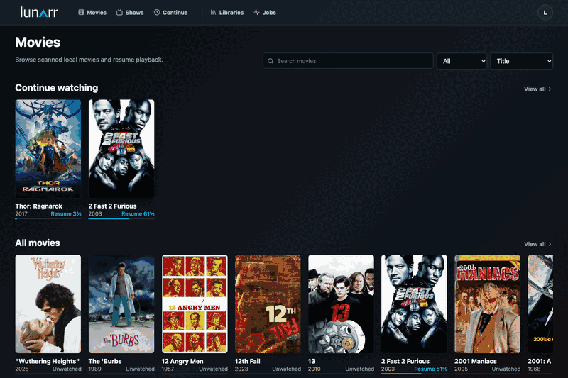

# Lunarr

Lunarr is a self-hosted media server for movie and TV libraries on local disks, SFTP, or WebDAV. It scans your files, matches them with TMDb metadata, and plays them with direct streaming or on-the-fly HLS transcoding. Chromecast and AirPlay are supported for remote playback.



## Features

- Local, SFTP, and WebDAV libraries with TMDb metadata, continue watching, similar titles, personalized because-you-watched recommendations, and a per-user watchlist
- Direct play or on-the-fly HLS transcoding, Chromecast and AirPlay, with optional hardware acceleration (including VAAPI)
- Sidecar subtitles (`.vtt` and `.srt`, normalized to WebVTT), FFmpeg transcoding, and intro/recap/credits skip markers via TheIntroDB
- Scheduled TMDb metadata refresh, continue-watching staleness filtering, person filmography pages, and light/dark profile themes
- Search, Continue/Discover/Browse hubs, and scheduled library rescans with live filesystem watching
- Admin console for user and role management, library management and sharing, a jobs monitor, and configurable registration and transcoding settings
- Device pairing, guest shares, API keys, OpenAPI docs, and a health endpoint for monitoring

## Quick Start With Docker

Run Lunarr with persistent app data. The `/mnt/media:/media:ro` mount is optional for local media libraries, replace `/mnt/media` with your host media path or remove that line if you only use remote libraries.
The published Docker image includes system FFmpeg for HLS playback and verifies the baseline FFmpeg requirements during image build.

```sh
docker run -d \
  --name lunarr \
  --restart unless-stopped \
  -p 3000:3000 \
  -e AUTH_SECRET=replace-with-a-random-secret-at-least-32-chars \
  -e ORIGIN=http://127.0.0.1:3000 \
  -v lunarr-data:/data \
  -v /mnt/media:/media:ro \
  sayem314/lunarr:latest
```

Open `http://127.0.0.1:3000`, create the first admin account, add a movie or TV library, then run a scan from Libraries. For mounted local media, add the container path, such as `/media`.

Docker Compose users can start from [docker-compose.yml](docker-compose.yml).

## Install With AUR

```sh
yay -S lunarr
sudo systemctl enable --now lunarr
```

Open `http://127.0.0.1:3000` and create the first admin account.

## Install With Homebrew

```sh
brew install lunarr
brew services start lunarr
```

Open `http://127.0.0.1:3000` and create the first admin account.

## Local Development

Install dependencies and create a local environment file:

```sh
bun install
cp .env.example .env
```

Set `AUTH_SECRET` in `.env` to a stable random value with at least 32 characters, then start the dev server:

```sh
bun run dev
```

Open `http://127.0.0.1:5173`, create the first admin account, add a library, and scan it.

## First Scan

Lunarr supports local, SFTP, and WebDAV libraries. Local libraries can watch file changes, remote libraries use manual or scheduled rescans.

Common TV layouts:

```text
Show Name/Season 01/Show Name - S01E02 - Episode Title.mkv
Show.Name.S01E02.mkv
Show Name/Show Name 1x02.mkv
Show Name/Season 1/02 - Episode Title.mkv
Show Name/Specials/S00E01.mkv
```

Common movie layouts (title with optional release year in parentheses or brackets):

```text
Movie Name (2024).mkv
Movie.Name.2024.1080p.mkv
The Movie (2024)/The Movie (2024).mkv
Movies/Movie Name (2024)/Movie Name.mkv
```

Common sidecar subtitle layouts (same base name as the video, with an optional language or label suffix):

```text
Movie Name (2024).en.vtt
Movie Name (2024).srt
Movie Name (2024).english.srt
Show Name - S01E02 - Episode Title.es.vtt
```

Subtitles are matched to their video by base name and an optional `.language` or `.label` suffix (for example `.en`, `.spanish`). The first track, or a track with no suffix, is treated as the default.

Supported video extensions are `.mp4`, `.mkv`, `.mov`, `.avi`, and `.webm`. Sidecar `.vtt` and `.srt` subtitles are detected during scans (`.srt` files are normalized to WebVTT for playback).

## Documentation

- [Getting Started](docs/getting-started.md): first-run setup, TMDb, adding libraries, and scanning.
- [Configuration](docs/configuration.md): environment variables, Docker, data storage, and production start.
- [Libraries](docs/libraries.md): local, SFTP, and WebDAV behavior, watchers, scheduled rescans, and remote tuning.
- [Playback And Maintenance](docs/playback.md): direct play, HLS, playback targets, transcode cache, cleanup, and job history retention.
- [API](docs/api.md): authenticated JSON APIs and API-key usage.
- [Transcoding Runtime](docs/transcoding-runtime.md): FFmpeg playback and NodeAV probing implementation notes.
- [Troubleshooting](docs/troubleshooting.md): locked-out admin, password reset, and data reset.
- [Contributing](CONTRIBUTING.md): local setup, checks, coding guidelines, and PR expectations.

## Verification

```sh
bun run check
bun run build
bun run test
bun run verify:ffmpeg
bun run verify:nodeav
bun run verify:runtime
bun run smoke:transcode
```

To verify live TMDb connectivity and poster metadata once credentials are configured:

```sh
bun run verify:tmdb
```

## Notes

- The first registered user becomes admin.
- Later signup is disabled by default unless an admin enables it in Settings.
- `AUTH_SECRET` must stay stable between restarts.
- `LUNARR_DATA_DIR` stores the SQLite database, per-session HLS playlists, and shared HLS cache segments. Keep it on persistent storage.
- Admins can share each library with all users or only selected regular users.
- Raw library paths, scan errors, jobs, users, and settings are admin-only.
